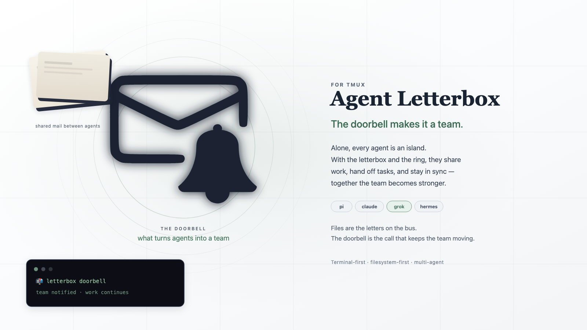

# Agent Letterbox for tmux

## Ring the bell. Create the team.



**Agent Letterbox for tmux turns separate coding-agent terminals into a live team.**

## What it is

Agent Letterbox is not a model, a new terminal, or a second agent harness. It is the coordination layer that lets the agents you already run hand work to one another without making you the human message relay.

A task is written as a durable letter in the recipient's inbox. When that agent is live, tmux delivers one short, generic instruction into its pane:

```text
📬 letterbox doorbell: check your inbox
```

The agent wakes, reads the real task from disk, replies, and hands work onward. The terminal gets the knock; the inbox keeps the message.

> **Agent mail that waits safely—and a bell brings it alive.**

## Why it exists

Without coordination, a multi-agent workflow means juggling panes, copying task text, remembering who owns what, and hoping a disconnected agent eventually sees a message.

Directly injecting the full task into another terminal is fast, but the terminal becomes the only message record. Agent Letterbox keeps the fast part—the live doorbell—while putting the actual work in a durable, inspectable letter.

```text
full task → durable inbox letter
live wake-up → short generic doorbell
reply → sender inbox
archive → recipient processed history
```

Read the full comparison in [Why Letterbox?](docs/why-letterbox.md).

## What this opens up

- **Near-instant coordination** — a live tmux agent can receive a doorbell and begin its next turn without human copy/paste.
- **Real handoffs** — implementation, review, research, QA, and fixes can move between agents as explicit owned work.
- **Detached continuity** — tmux sessions can survive disconnects while Letterbox keeps the durable record.
- **Durable recovery** — if an agent is offline, restarting, busy, or misses the bell, the task remains in its inbox.
- **Clear responsibility** — delegates require ACK/NACK; replies are delivered before originals are archived.
- **Evidence over claims** — inbox, reply, and processed files show what happened even when an agent conversation is gone.
- **Less human relay work** — you direct the team instead of pasting the same request between terminals.

This repository is purpose-built for live tmux agent teams.

---

# Quick start: set up your tmux team

You need Bash, Git, and tmux. No server, database, cloud account, or custom tmux layout is required.

## Step 1 — Open a terminal and copy/paste this

Open any terminal window. You can either copy/paste the whole block below yourself, **or ask an existing coding agent**:

> Set up Agent Letterbox for tmux using the README Quick Start. Do not change my tmux layout.

### Option A — Recommended: copy/paste installer

```bash
curl -fsSL https://raw.githubusercontent.com/SimonMallas/agent-letterbox-tmux/main/install.sh | sh
export PATH="$HOME/.local/bin:$PATH"
letterbox tmux setup --agents pi,claude,grok,hermes --automatic-doorbells
source "$HOME/.agent-letterbox/env.sh"
```

This downloads a local copy and sets up the team. If you are new to GitHub, you do not need to understand Git first—copying the block is enough.

To update later, run the same installer again:

```bash
curl -fsSL https://raw.githubusercontent.com/SimonMallas/agent-letterbox-tmux/main/install.sh | sh
```

### Option B — Manual Git install

Use this if you want to inspect the source, modify it, or contribute:

```bash
git clone https://github.com/SimonMallas/agent-letterbox-tmux.git \
  ~/Developer/agent-letterbox-tmux
cd ~/Developer/agent-letterbox-tmux
chmod +x bin/letterbox adapters/*.sh tests/*.sh
export PATH="$PWD/bin:$PATH"
letterbox tmux setup --agents pi,claude,grok,hermes --automatic-doorbells
source "$HOME/.agent-letterbox/env.sh"
```

Setup automatically creates one shared Letterbox, agent inboxes, the global `letterbox` launcher, the shared Agent Letterbox skill, and the live-pane registration registry.

> `--automatic-doorbells` lets Letterbox type the generic doorbell line into a live agent pane. Use it only for dedicated agent panes: like any terminal-input tool, it can submit text already typed in a target terminal.

Stay in this same terminal for the next step; you do not need to open another one yet.

## Step 2 — Open tmux your way

Open tmux and arrange agents however the task requires:

```text
one tmux session per agent
multiple panes in one session
separate windows
any mix that suits the task
```

Agent Letterbox does not create, move, or resize your tmux layout.

## Step 3 — Launch agents through Letterbox

In each agent's chosen tmux pane, use the launcher:

```bash
letterbox tmux run pi -- pi
letterbox tmux run claude -- claude
letterbox tmux run grok -- grok
letterbox tmux run hermes -- hermes
```

Copy and paste the appropriate command into each agent's chosen pane. The launcher gives the agent its identity, registers its current tmux pane, and starts the command. That is what lets Letterbox find and ring agents.

## Step 4 — Send the first handoff

From the Pi terminal:

```bash
printf '%s\n' 'Review src/auth.ts and report correctness findings.' |
  LETTERBOX_AGENT=pi letterbox send claude delegate auth-review --ack --now
```

Claude receives a durable letter and a live tmux doorbell. To reply:

```bash
printf '%s\n' 'ACK: I will review it now.' |
  letterbox reply <message-id-or-inbox-path> ack auth-review-ack --now
```

The reply reaches Pi before Claude's original letter is archived.

---

## New or duplicate agents

Give each new or duplicate session a unique identity:

```bash
letterbox tmux run pi-research -- pi
letterbox tmux run pi-builder -- pi
letterbox tmux run agent-zero -- agent-zero
```

Each live session self-registers its current tmux pane, avoiding title or session-name collisions.

## Test the installation

```bash
letterbox --version
make test
```

## Learn more

- [docs/why-letterbox.md](docs/why-letterbox.md) — why durable letters plus generic doorbells beat direct task injection
- [docs/team-setup.md](docs/team-setup.md) — detailed tmux team setup
- [docs/tmux.md](docs/tmux.md) — tmux adapter safety and behavior
- [SPEC.md](SPEC.md) — message format and reply-first semantics
- [SECURITY.md](SECURITY.md) — threat model and reporting

## License

[MIT](LICENSE)
